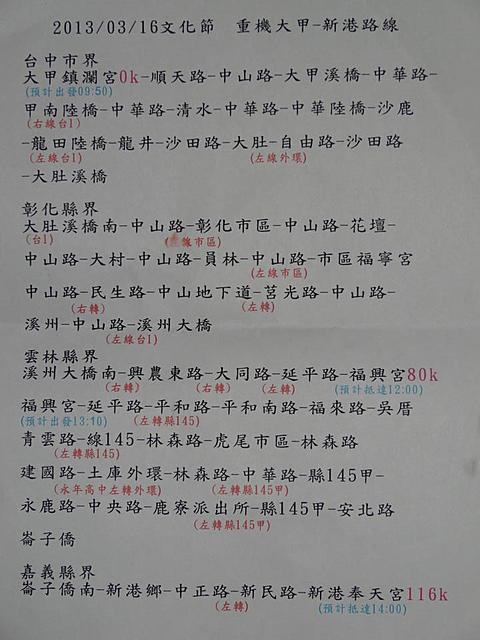
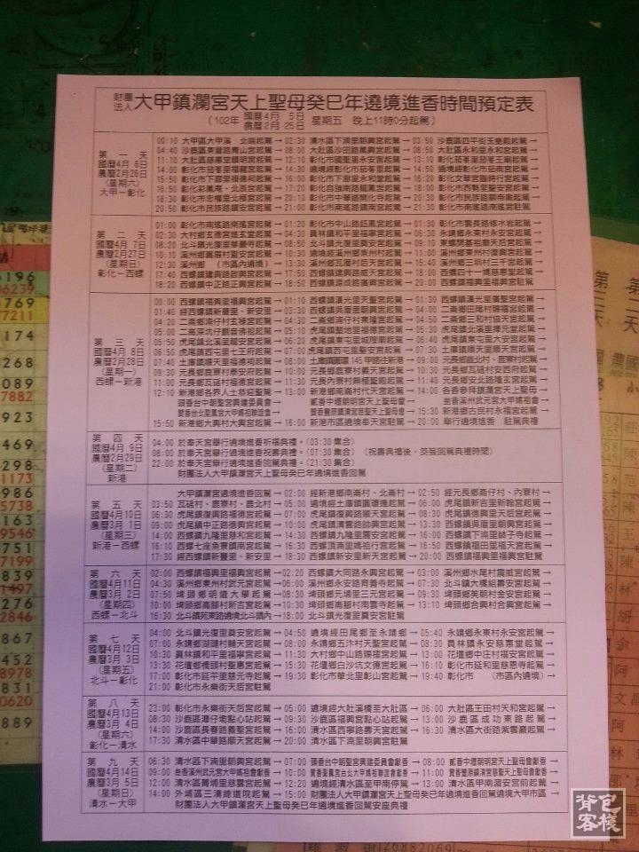

[TOC]
##大甲妈祖绕境活动
清雍正十年（西元1732年），福建湄洲人氏林永兴在大甲兴建了一座供奉妈祖的小祠，200多年过去，当年的小庙早已成为当地人民的信仰中心和精神堡垒，这就是大甲镇澜宫的历史，而现今规模的镇澜宫建于1988年，“镇澜”指的是“镇海安澜”，也就是“镇住海浪，以供海上往来之人船皆平安”之意。

而大甲妈的进香绕境活动，始于清朝开庙之初，每十二年一次，由大安港或温寮港直接驶往湄洲进香，这项传统直到日治时期，大安港废港，日本政府严禁台海两岸往来才告中断，之后大甲妈祖进而转向北港朝天宫“割火进香”。1988年之后，镇澜宫改往新港绕境进香，大甲妈祖从北港“谒祖进香”改到新港“绕境进香”，不仅是名称不同，更代表大甲妈祖辖区的扩大，也象征自我地位提升。

绕境活动相当于妈祖出巡，巡视其辖区来驱逐鬼魅，以庇佑信徒阖家平安。主要是人与神交，人再度回到妈祖的灵力世界中，尤其是在充满了灵交的祭奠活动中，进香具有净化礼仪的作用，在与妈祖相接时可以洗涤自身已知及未知的罪恶与灾难，且在妈祖灵力和护持下获得了赐福保佑。

时至今日，大甲妈“天上圣母”的绕境进香，不但是镇澜宫最大最重要的活动，也已成为台湾宗教界的一大盛事，2006年台中县政府与镇澜宫更联合举办了“2006台中县大甲妈祖国际观光文化节”，希望透过宗教活动与观光资源的结合，将进香活动提升为台湾重要文化庆典，进而成为国际性的文化观光节庆。

因此从2004年开始，以七大主轴贯穿妈祖文化节，分别是信仰、武艺、戏曲、产业、艺术、观光、学术，希望将文化的深度与广度，引介到这个庞大的民间信仰当中，所以文化节中不但保有传统大甲妈祖进香绕境的阵头及团体，并邀请国内外武术表演及艺文团体参加，**将妈祖宗教信仰的意义，以文化形式代代传承下去。**
##绕境时间是怎么确定的？
大甲妈祖绕境进香活动，每年活动的时间都不固定，是在该年元宵节时由镇澜宫董事长，向妈祖掷筊来决定进香出发的日期与时辰。
##2017年大甲妈绕境要走几天呢？

2017年绕境的时间定在阳历3月24日起驾前往新港奉天宫进香。路线从大甲镇出发后，沿海线经清水、沙鹿、龙井、大肚、彰化、花坛、员林、永靖、田尾、北斗、埤头、溪州，到云林县的西螺、虎尾、土库、元长，最后则来到嘉义新港奉天宫，待举行过盛大庆典后，再沿原路回大甲。

这趟经过21个乡镇，近百座的庙宇，跋涉330多公里的路途上，将会有多元丰富的阵头和数以万计，绵延数公里的信徒，以徒步的方式跟随大甲妈祖前往新港奉天宫进香，是全台规模最大、人数最多、范围最广的徒步绕境进香团，从空中鸟瞰就是一幅壮观景象，让人无比的震撼，这也让大甲妈祖的绕境进香从民间信仰成为世界三大宗教活动之一。
##绕境具体怎么走？

大甲-清水-沙鹿-龙井-大肚-彰化-大村-花坛-员林-永靖-北斗-溪州-西螺-二仑-虎尾-土库-元长-新港。

新港-元长-土库-虎尾-西螺-溪州-北斗-埤头-北斗-田尾-永靖-员林-大村-花坛-彰化-大肚-龙井-沙鹿-清水-大甲。

##过往路线出发时间参考

