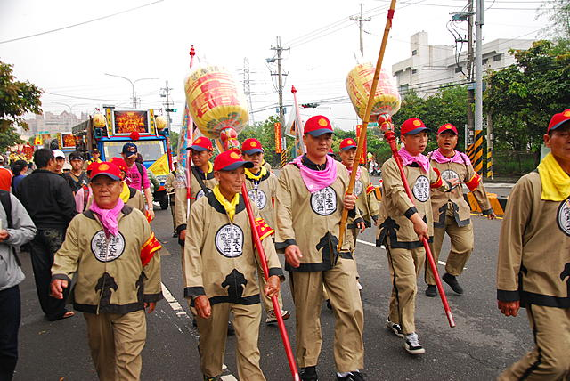
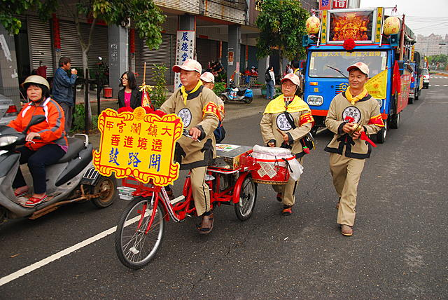
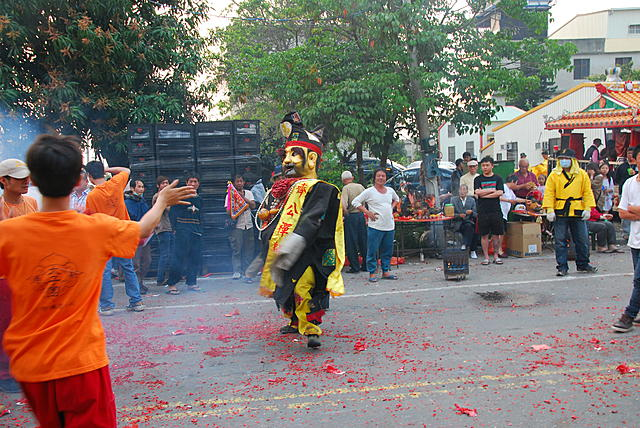

[TOC]
#大甲妈祖绕境进香活动的仪式
##准备仪式
绕境有着许多重要的仪式和典礼，其中的“筊筶”和“竖旗”是绕境进香前的准备仪式；“筊筶”典礼是指向妈祖请示今年要进香起驾的时刻，通常是该年元宵节的下午六点举行，同时也协调决定“头香”、“贰香”、“参香”、“赞香”的顺序，各香需义务聘请剧团演出为妈祖祝寿，并于进香期间聘请艺阵随行，这同时也是向全国各地宣告今年大甲妈祖的绕境进香日期。
而“竖旗”仪式，指的是竖头旗，头旗是绕境进香的指挥旗，镇澜宫要将头旗绑在左侧龙柱上，并在沿途停驾或驻驾处贴上香条通知沿途信徒，妈祖起驾、回驾及经过当地时间，同时也代表着向三界昭告年度绕境进香的各项工作开始正式启动。
下面具体介绍一下阵头:
##起驾
起驾时间都在午夜十二点左右，当时辰一到，点燃三响“起马炮”，由神轿班的人员将神轿扛起，进香队伍便启程前往新港。在神轿起驾前，所有钟、鼓、哨角齐鸣，并由镇澜宫董事率领信徒，跪在轿前，恭请妈祖起驾遶境进香，庇佑众人一路平安。
妈祖绕境队伍浩浩荡荡，其中**包含报马仔、头旗、头灯、三仙旗、开路鼓、大鼓阵、绣旗队、弥勒团、太子团、神童团、哨角队、庄仪团、执士队、轿前吹、自行车铁卫，以及最重要的神轿班。**
###报马仔
他是进香团队的急先锋，负责察看前方路境是否安全，随时回报妈祖路况，并且沿途敲锣通知信众收拾晾晒衣物，准备香案迎接妈祖。

他的滑稽装扮每每令人留下深刻的印象，在庄严的迎神时刻让人会心一笑。报马仔的造型相当突出，每每吸引众人的目光，他头戴斗笠以防晒，肩搭簑衣以防雨，身穿黑色衣裤、羊毛袄以禦寒，戴老花眼镜表示他看得清楚，带茶壶、留燕尾鬍鬚、吸旱烟管、喝葫芦酒表示他洒脱自在，携带猪脚韭菜表示他不受饿、有吃食而且长生，脚贴五彩圆纸是因为脚生疮，表示人生难免不全，着一隻草鞋、捲起半隻裤管，表示他虽工作辛苦，但忠於职务，纵使捲起裤管、鞋子掉了一隻，形象滑稽也不在乎。他的滑稽装扮每每令人留下深刻的印象，在庄严的迎神时刻让人会心一笑。
在队伍中总是特别显眼，由于走在整个队伍最前面，为了一求姻缘线(红线)，不少人紧追在后呢！
红纱线原来只是报马仔隨身携带用来绑东西的线，並无特殊意义。相传有一年，有一妇人向报马仔请求给予一物，以保家内之平安。报马仔就给了她绑东西的红线，结果不久他儿子便结婚了。 
此事一传十，十传百，向报马仔请求红纱线的人竟越来越多。他们有的是希望孩子乖乖平安长大，有的祈求家内平安，有的希望生意兴隆，有的期望身体健康，有更多的未婚男女希望藉此获得婚缘，所以现在他只好准备一大捆，以备不时之需。於是向报马仔请求给予红纱线，便成为另一项遶境进香队伍中的特殊景象！

###旗队(头旗、头灯、三仙旗)
1.头旗代表妈祖，四方形的杏黄色头旗，绣有“大甲镇澜宫天上圣母、头旗、（谒祖）绕境进香”的字样，旗头为木刻红葫芦，两枚红绒球装饰，葫芦上插贡香一枝，旁有一蓝一红小灯，灯号与大轿上的灯号配合，行进时掌旗使双手执旗，旗面在前。是带领整个进香团往前迈进的前导。

2.头灯则立于头旗两旁，代表整个进香团的眼睛也代表光明，为照明之用，灯上绘有八仙，书有「大甲镇澜宫天上圣母、（謁祖）遶境进香、合境平安」的字样，掌灯者立於头旗两旁。

3.“三仙旗”为头旗副手，协助带领队伍。旗面书上「大甲镇澜宫天上圣母」，两旁蓝旗为护驾，旗面书上「大甲镇澜宫 （謁祖）遶境进香」，旗头也装饰红葫芦，但不插香，行进时置於掌旗使肩上。
###开路鼓
是大甲妈祖进香队伍的开路乐队，这一组是辛苦的一组，因为进香队伍一开拔前进，「开路鼓」不分昼夜，沿途步行吹奏敲打，是最简便的音乐性阵头，乐器包括有鼓、锣、鈸，及二支嗩吶，演奏时以鼓为中心，其他乐器则配合鼓的节奏。开路鼓所演奏的乐曲多为九甲戏曲牌，音乐风格轻快热闹。

###神明团
进香团的阵头中，还有不同的神明团，像是土地公、玉女与三位罗汉组合而成的福德弥勒团；三位大肚弥勒所组成的弥勒团；当然还有庙会中不能缺少的三太子哪咤的太子团，以及可爱的神童团。
1.福德弥勒团
福德弥勒团的成员有土地公、弥勒佛、达摩祖师、古佛，及玉女等五尊神偶。其中笑容开怀的弥勒佛，代表「福」；浓眉黑脸的达摩祖师，代表「禄」；留着白鬍鬚的古佛则代表「寿」。他们右手持拂扇，左手拿酒壶，以醉步方式前进。 

大甲福德弥勒团的土地公是右手执柺仗，左手拿大元宝，象徵赐福添財，遊行时以慢步前进，代表祂年事已高且平易近人。玉女造型可爱如小女孩，行进时以细步跳跃步伐前进。 
2.弥勒团
弥勒团，原为福德弥勒团成员另组之团队。 
耳大脸圆的弥勒佛，是福气与欢乐的象徵。弥勒团内三位主角：「弥勒祖师」、「弥勒古佛」、「弥勒罗汉」，除衣服的颜色（弥勒祖师代表「禄」，着黄色服，有着正气凛然的浓眉大眼和黑脸；弥勒古佛代表「寿」，着粉红服，有着长而花白的鬍鬚。）不同外，其餘如造型、服装的样式、手拿的葫芦及扇子等完全相同。 
他们左手拿酒，皆以喝酒表示敬意，右手则执拂扇，背部的衣服上绣有八卦。而土地公则是右手执柺仗，左手拿大元宝，给人赐福添財的感觉。玉女因为颇具童心，被人视为是孩子最好的守护神，所以常有人想换取她嘴上的奶嘴，拿回去给家中的小孩，好让小孩能平安长大。
4.太子团
在太子团中主角为「太子元帅」和「济公活佛」两位神尊。太子元帅哪吒身穿黄色战甲，背插五营旗，左手拿铁製圆环，右手持枪，以踩七星步以之字型方式前进。 

信众认为太子元帅哪吒顽皮好动，需有大人在旁管教，因此才增加济公神偶，加以保护约束。济公在太子团中是满嘴鬍鬚，一副不修边幅的样子。头顶僧帽，右手拿破扇，左手则拿葫芦，葫芦内装酒，边走醉步边饮酒，将济公形象生动地表现出来。

4.神童团
神童团指的是「招財」及「进宝」二尊神偶，象徵为信徒祈求財富招宝进宝。「招財神童」头绑一束髮髻，身穿绿色衣服，右手拿羽扇，左手执拂尘；而「进宝神童」则是绑二个髮髻，穿粉红色衣服，右手也是拿羽扇，左手拿令旗。二位神童在行进间碰碰跳跳，表现出活泼可爱的模样。
5.庄仪团
庄仪团为妈祖的首席护卫──「千里眼」、「顺风耳」两位将军。由於是护卫将军，当然要呈现出庄严、威仪的態势，故命名为「庄仪团」。
大甲妈祖庙所配祀的水精将军（千里眼），蓝色的脸庞、身着绿色蟒掛；金精将军（顺风耳），为红色的脸庞、身着红色蟒掛，二者为妈祖的部属，保护大甲妈祖前往新港进香。祂们头戴金箍、头后悬掛「高钱」，手上则握有「手钱」，相传高钱、手钱可以避邪保平安，治疗筋骨酸痛，沿途若有掉落，信徒们爭相拾取如获至宝。

千里眼、顺风耳本为妖精，故后脑勺繫有一串黄色「高钱」，手上握有一叠黄色「手钱」，民间传说高钱及手钱具有驱邪、治疗疑难杂症…等功效，且二位将军又是妈祖的首席护驾，身上所掛的高钱就成为民众爭相抢夺的重点。
「高钱」和「手钱」每天都需要更新，而换下的高钱、手钱则分送出去，因是将军隨身物品传言具驱 邪作用。因此在遊行过程中，每当有高钱抖落，民众就会「奋不顾身」的上前抢拾。

###哨角队
整个队伍前方有三面旗帜、两面锣、其餘为L型的哨角（號头）和直式的哨角所组成，哨角必须是双数。
哨角必须依锣声的指示而吹奏，平常锣声单击十一下，连续两下，则吹奏。哨角声音低沉，其功能在开路及驱魔。因在进香队伍中位居主神轿前方，听到哨角声即宣示主神即将到来，带有威严之意，並具有开路作用。 
若听到急促且快速的乱锣声，表示进香队伍即将接近丧家或墓地，为避免孤魂野鬼拦轿申冤陈情影响队伍前进，哨角必须赶紧吹號呼唤兵将前来护卫並驱离孤魂野鬼。 

L型的哨角（號头）

###绣旗队

都是娘子军，身着清代武士装束，英姿飒爽，显示了女性的威仪。
原本在大甲妈祖进香的行列中是没有绣旗队的，民国五十二年（西元1963）正式成立（在此之前也有男士执绣旗数支参加如溪州仔的洪、横圳庄的黄辉煌即属之，然南下与 否全凭炉主决定），当初设置的目的在於充实进香队伍的阵容，此后逐年扩充，曾经达到三百六十餘支，近年在庙方人员、车辆的考量之下，才加以控制，避免人数 过於庞大，多以三百人参加，因此在僧多粥少的情况下，每每在元宵节当天晚上报名就已爆满。镇澜宫的绣旗队为全国规模最大的。
绣旗，即在布旗上刺绣之意，旗上绣有主神、宫庙或艺阵名號及吉祥图案。大甲妈祖的绣旗队专由女性香客所组成的进香队伍。 
绣旗队行进时成两路纵队，依序而行，遇庙或是阵头必须行礼，左侧者左脚在前，右侧者右脚在前，两人一组行礼。
###三十六执士队
执龙凤旗，十二面彩牌和十八般武器的三十六执士等。
执士队相当於皇帝出巡的仪杖队伍，古代的帝王、君侯出巡，必有隨从兵士开路、护驾，执士队中彩牌具有开路功能，而兵器则具有护驾作用，故三十六执士走在大轿前方，以达到开路及护驾的作用。
执士队，或称「执事队」，前半部手持「长脚牌」，长脚牌为一木牌，书写着「肃静」（肃静牌）、「迴避」（迴避牌）、「天上圣母」（主神 牌）、「遶境进香」、「风调雨顺」、「国泰民安」，共十二面。

后半部手拿各式武器之「执事牌」，而执士牌是执行任务用的各式兵器。计有：龙头（最前方）、日月牌、枪、槊、戟、双戟、刀、关刀、斧、鉞 矛、印架及令旗（殿后）…等，共三十六支，排成两排。故称为「三十六执士」。

执士队现在共有一对龙凤旗，十二面彩牌和十八般武器，龙头柺居前，凤尾压后，行进间如遇丧家，执士散开，将妈祖大轿护卫在中间，避免邪魔犯驾或冤魂拦路告状。
###轿前吹
是「鼓吹阵」的一种，专为神轿开路之用。乐器包括嗩吶、通鼓、小钞（鐃鈸）等。平常在行进时沿途吹奏，神轿入庙时则在一旁演奏，等到神轿进入庙后再隨同启程。 

###神轿：
妈祖神轿是进香队伍的压轴也是信徒最关注的焦点。大甲妈祖神轿以藤编製，由八人扛抬，外型如一座小型庙宇，轿顶有两盏小灯，行进时亮蓝灯，停驾时则亮红灯。此外轿后另有两隻芭蕉扇紧隨神轿。
在进香队伍中压阵的即是妈祖神轿， 神轿所到之处炮声隆隆不绝於耳，据民间传说大甲妈祖神轿特別具有灵 ，因此进香九天的时间隨时都有人来摸一下、 扛一段、 不少人乐此不彼。这座大轿是藤身木座， 外披刺绣，外型如一座小型庙宇，轿顶有两盏蓝、红小灯，行进时亮蓝灯，停驾时则亮红灯，全程均由人扛。

###自行车铁卫

##祈福
祈福典礼后的上午八时举行，为天上圣母祝寿，虔心祝祷、诵经读疏、三跪九叩，祝贺妈祖万寿无疆，同时也向妈祖“掷筊”决定回驾时间。当祝寿典礼接近尾声时，众人举旗欢呼，就在清脆的铃声中、壮观的旗海里，将那一股虔诚之心推到最高点，这也是整个遶境活动最高潮，最感人的时刻。
- - - - ---
#还有哪些活动可以看？
1.起驾时的国庆级烟火@大甲桥
2.每个宫都有盖章

------
#妈祖小科普
###什么是“掷筶”？
掷筊是一种道教信仰问卜的仪式；又称掷筶、掷杯、**博杯**，普遍流传于华人民间传统社会。“筊杯”是一种占卜工具，是世俗之人所用以与神明指示的工具。
多用竹、木等材质做成，两个为一对，呈立体的新月形状，每一个称为一“支”，并分有正反面，凸起部分称为“阴面”（也就是反面），平面的部分则称为“阳面”（也就是正面）。仪式内容是将两个约掌大的半月形，一面平坦、一面圆弧凸出之筊杯掷出，以探测神鬼之意。
下列是阳阴组合的说明：
>- 一阳一阴（一平一凸）：称之为“圣杯”、“允杯”（或“圣筊”）表示神明认同，或行事会顺利。但如祈求之事相当慎重，多以连三次圣杯才做数。
>- 两阳面（两平面）：称之为“笑杯”（或“笑筊”），表示神明一笑，还未决定要不要认同，行事状况不明，可以重新再掷筊请示神明，或再次说清楚自己的祈求。
>-  两阴面（两凸面）：称之为“阴杯”、“无杯”（或“怒筊”），表示神明不认同，行事会不顺，可以重新再掷筊请示。

在民间信仰中，掷筊有几个约定俗成的礼仪如下：
>- 掷出允筊通常以三次为限。
>- 掷筊前需在神灵面前说明自己姓名、岁数、生日、户籍地址、现居住址和请示的事情。
>- 掷筊前双手要合住一对筊杯，往神明面前参拜之后，才能松手让筊杯落下。

###台湾特色:艺阵
>艺阵，又称走会，于东亚传统民间进香绕境、迎神赛会场合中，为“迎热闹”之主力。“艺阵”一词为台湾的称呼，是**艺阁与阵头**的并称。

艺阵具强烈表演功能，由寺庙提供，俗谚有谓“输人不输阵，输阵歹看面”，可看出艺阵在宗教场合的重要。
1.艺阁
艺阵之中的“艺阁”乃由真人或偶人坐在其上扮演各种民间故事的华丽活动舞台。

台湾的艺阁有蜈蚣阁及装台阁两种，装台阁是在木座上装置楼台亭阁，由孩童扮演历史或戏剧人物，或坐或立于台上；蜈蚣阁则是以多个艺阁串联而成，行进时宛如蜈蚣行走故名。而蜈蚣阁因其具有宗教功能自成一阵，所以称为蜈蚣阵，现今艺阁多是指装台阁为主，装台阁属小型艺阁，有在汔车上装设楼台布景，设置电动假人的，或真人置于其中的；也有装阁在三轮车上而多台串连起来的，在学甲上白礁里可以看到所有艺阁的种类，有后社集和宫的蜈蚣阵、有设于汽车上的艺阁，也有三轮车的艺阁如白礁宫的董汉寻母及宅口角兴太宫的五虎平西，更有类似蜈蚣阵的罗姓角八仙棚。
**艺阁台上的人物，通常都由童男童女扮演，个个打扮得花枝招展，浓妆艳抹，穿着华丽的戏服在台上全力演出。**

2.阵头
阵头一名来自台湾，台湾阵头分为文阵和武阵，常见阵头有：车鼓、桃花过渡、牛犁、布马、踩脚、大鼓阵、病囝歌、十八摸、宋江阵、什家将、八家将、舞龙、舞狮、官将首等。

###资料来源
概念出自维基百科，图片来源于网络
