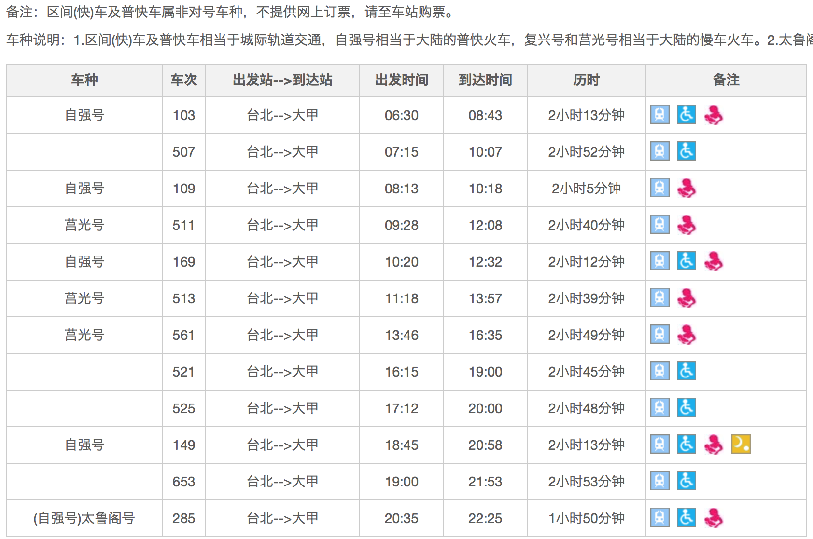

[TOC]
##心动的你可以选择的绕境方式
- 徒步
- 单车
- 机车
- - - - --
##交通指引

从台北出发到台中市大甲大概需要3个小时的车程。
>再讲一下 交通问题好了.. 
>台铁到大甲的对號快车班次一天不多 位置也不多 所以那天全省有很多人都要到大甲
>因此就像订过年返乡车票一样 瞬间秒杀...
有买到车票的也別爽得太早 有的人中午就到了 在这边窝着很无聊 等到你睏死
>建议台北来的 买对號快车到竹南 再转搭海线电车到大甲 除了每天运行的班次外
>基本都会会有到大甲加班电车三班
>南部来的 就搭到彰化市 再转搭海线电车到大甲 这样就不用担心买不到票了
因此在竹南月台 跟 彰化月台 你会碰到一堆同好 带旗子的人会一起上车 然后到了大甲 车子马上清空 因为都是来进香的 . 尤其是彰化市民 他们搭车来 就顺便跟妈祖一起走回彰化了 
> 再买不到票的 或是当天无法请假的 请搭程台湾高铁到台中站
高铁台中为双铁共构 有一台铁新乌日站 .. 但有分海线电车跟山线电车
转海线电车就能到大甲 如果上错车 到了彰化 也记得下车 彰化每小时电车到大甲
但是请转车的自己查清楚 也都会有加班电车

如果从台北到大甲镇澜宫, 可以这样坐大众交通工具:
方法一 高铁到台中乌日,在转台铁到大甲
1.台北搭乘高铁到台中站(NT700) (如果坐台铁到台中站,则直接看第3点)
2. 在台中高铁站内 走路前往 台铁新乌日站 (有室内通道)
3. 买台铁 区间车票 往 大甲(NT51) (台铁-成追线)
4. 在大甲火车站下车, 走路前往 镇澜宫
但是要经「海线」的班车即可到达大甲站
走山线是不会到的
方法二 搭台铁到竹南换车…到大甲
1.买对號快车到竹南 再转搭海线电车到大甲 除了每天运行的班次外
基本都会会有到大甲加班电车三班..

方法三 搭台铁直接到大甲(票不好买喔)
1.台北上车,大甲下车 班次不多,选择性少,票也少…..

行程表出来了!! 大家已经开始准备了喔!!加油
【大眾交通建議】
搭乘台鐵至大甲火車站→出站沿蔣公路步行即可抵達
【自行開車】
行駛國道三號至大甲出口下交流道→接續行駛中26縣道即可抵達。
繞境期間可選擇步行、自行車、機車等各式交通工具。

大甲镇澜宫：台中县大甲镇顺天路158号 04-26763522新港奉天宫：嘉义县新港乡新民路53号 05-3742034

- - - - -
##住
##吃
九天活动内也有救护车跟随及盥洗车一路跟随，吃的部份更不用怕没东西吃，**一般是起驾后是素餐回銮是荤食**。
24小时沿路都有信众提供食物供应怕饿到。
##喝
有茶水车
##洗澡
驻驾的庙宇旁都有停一辆由货柜车改装的沐浴专用车，一次可供20人左右使用，而且热水与沐浴用品皆有供应，只要带着毛巾排队，领了钥匙便能入内使用。
而换洗下来的衣物一旁还有黑猫宅急便驻点服务，替你把不需要的衣物免费寄回家。

##休息
加油站，有水有厕所
##手机充电
1.中华电信手机充电车
2.庙裡大殿旁充电(注意小偷)
值得留意的是绕境扒手特别多，**所以请大家不要带太多钱在身边免得被偷手**，这是年年会发生的事，有长者要跟的家人请告诉他们。
