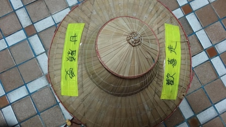
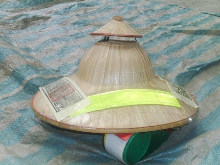
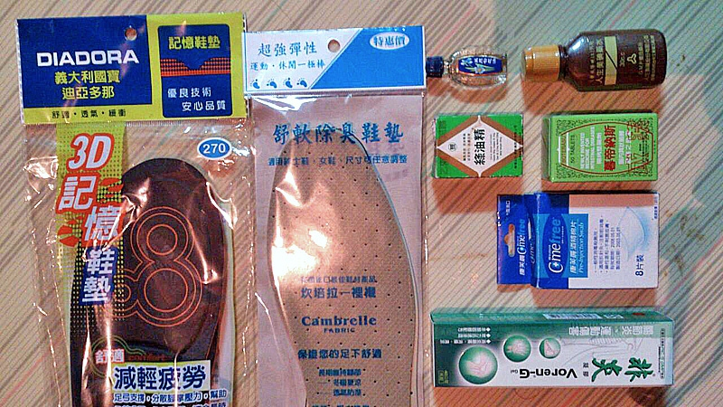

[TOC]
##装备篇(主要来源富哥，查看苦富茶团)
###一、斗笠
请先贴上两片反光布条再写上“甘愿受  欢喜走”，另两边再贴上平安符。斗笠最好买太子楼型，请至五金行或杂货店购买。

贴反光布条是因为晚上下雨时斗笠会放在背包后面，遮住背包上的反光布条，所以用来吸引来车注意。(本团的辨识是用斗笠，所以参加者都必须有一顶，如不昜买到可代购，约100元左右，不加反光布条和令符。请在报名时先登记。代购斗笠请2点前到，过时让人。)

    
###二、衣服(新人以上所有东西必须使用全新的，除布鞋外)
- 洗澡用毛巾两条(太阳有时候虽然看起来不大,但走上一天可以让你的脖子全部脱皮，挂脖子上防晒)
- 内衣5件，男女都一样，女生最好用运动内衣，如果没有请用素色内衣。
- 内裤，5件男生请用四角型长筒纯棉内裤，要有弹性才不会烧裆，女生可用免洗裤，男生不行
- 衬衫5件，请用亮色系的颜色，晚上走路后方人员才比较容易看到，长、短袖都可以，短袖的要加一双袖套，上衣必须是有领子的才不会晒黑。(排汗衫，因为其实沿途能借住的民宅或庙宇大多都会有脱水机，此时排汗衫脱水后干很快，可以减少行李重量)
- 骑脚踏车用的袖套
- 长裤三件，不要太厚太重的，裤管要可以拉到膝盖的才可以，每件可穿两天
- 短裤一件，因为有时大腿铁腿时擦药比较方便。
- 袜子5双，要用**五指袜**，中厚的，比平常的厚。(出发前让五隻脚指及脚踝缠绕(贴)透气胶带，这可防止水泡的产生。(蛮有效的，走了2~3天我的脚没起任何水泡就是了)
- 布鞋一双，旧的也可以，不要穿新鞋，但必须有鞋带鞋子才绑得紧，鞋底要厚的，不可穿休闲鞋，登山鞋，布鞋。鞋底也不可太硬，一双约500至700元左右，你的脚指如果太宽，走路时会压到小姆指，可以将布鞋剪一个洞。
- 鞋垫要多买一双要和下图一样的，一双约120元。同时用两层鞋垫脚底更不容昜起水泡
- 拖鞋一双，鞋底要厚的，不能用一般室内施鞋，最好能大一号，在家先绑好弹性裤带长约65公分宽一公分，下雨天要穿拖鞋才不容昜掉。(拿令旗的婆婆们穿crocs之后的几年再也没有出过水泡，但是富哥不建议)
- 秋天簿外套一件，怕冷的人可在准备毛线衣一件
- 雨衣一件约120元的
###三、住宿用品
- 睡垫单人簿的一件，一面有铝箔纸，一面没有，因为睡垫太小必须另外准备帆布或桌巾一件长240公分宽100公分，休息时帆布垫在睡垫下面，睡袋才不容昜脏。
- 睡袋一件轻型重约一千公克(一公斤)，要纯羽毛的较保暖。约2500元，或买人工蚕丝约600元较不暖和。

###四、盥洗用品
卫生纸、香皂、牙刷、牙膏、刮胡刀、棉花棒等等。盥洗问题都在庙里面的浴室，睡觉问题一般都在学校或商加的骑楼、走廊。请不要以为是睡在旅社或庙里的客房。
###五、个人用品 
- 绿油精或万金油一瓶
- 普拿痛一包、酸痛药膏一条(涂抹)、白药水一瓶
- 蚊子多，防蚊液小一瓶、蚊香一盒约6片
- 刮痧板一片
- 耳塞两粒(海绵型)
- 眼罩一个
- 口罩一个(放鞭炮时用)
- 矿泉水一瓶
- 水杯
- 3M纸胶带一卷(另可加带肌肉鬏弛剂或抗发炎凝剂可有可无)
- 防晒用品男女都要
- 腰包一个
- 塑料袋(装雨衣雨伞)

###六、杂项
- 碗一个筷孑一双
- 手机一只，请多带一颗电池
- 充电器，多孔插座小一只，电池没电最好交给中华电信充电车充电(以免睡觉手机被偷，免费)
- 脚踏车用红色闪光灯一个
- 晒衣服用塑胶线长20公尺一条
- 夹衣服小夹子6支
- 5元的香一支(约原子笔大小，出发时起马要用)
- 在大甲溪桥用来起路马拜拜的香三支(一般种类的香)，寿金10分之一叠一份，
- 旧报纸全开6张(祝寿大典要用必带)
- 口粮一包
###七、背包
装备自已背不使用推车的人，建议背包一个(约30斤)不要太大太重，一定要有**腰带**，除睡垫进香旗之外，其他的物品都要放进去，最好在背包左侧面绑一小支竹子好插进香旗(如下图)。

使用班上推车，5人一组轮流推，使用班上推车每人要交200元推车维修费用，使用推车的人(包含自我备推车的人)请多带一个小背包，贵重物品必须随时背在身上。 使用班上推车，你的所有物品必须装得下一个5斗米的袋子里面(进香旗除外)多余的部份要自已背在身上(如下图)各人装备约台斤18斤(不包含家人的衣服，和背包的重量，和一瓶水)这个袋子是样品而己，请不要小看18斤背久了也会背不动，使用班上推车的人背包不可有背架，如有请自已背就好了。使用班上推车的人，当你走到一半不想走要去坐车时，或你要脱队先走请将你的物品带走。
###八、进香旗等
- 进香旗一支一定要，另加塑胶袋一只，回程要包进香旗或下雨要用
- 红包袋一个，要装垫轿金纸或红线
---------------
##心态篇
1.打包，每天要穿的衣服包在一起，一天一包，衣服用卷的体积比较小，放入5斤塑胶袋中。个人清洁用品一包药品也一包，一定要包好怕下雨泡到水(如下图)。所有物品在打包之前要用艾草加盐水净过，所有物品要在出发前三天准备好，身体在出发当天也要净身，出发前三天要开始吃素，所有物品以轻便为原则。

2.身上现金不要带太多除非在新港要买名产，身上的金项錬，名表请勿带来。

3.出发前15天开始练习走路(练越多天越好)，每天要走至少两小时，每小时4至5公里，要走在坚硬的地上，如:马路或水泥路，不可走在学校的跑道或泥土地。进香前三天停止练习，自己背，背包者前8天要背着背包走，练走时感觉脚底滑滑的就是鞋带太松。

4.参加本团完全免费，各庙宇要乐捐多少费用请自行斟酌。向民家拿食品或借用厕所要向主人说谢谢外，还要讲一句好话。口渴时一次最好只喝一大口水，因为上厕所不方便。

集合时间，新生于出发当日下午12点半至1点半报到，1点半集合开行前会议，旧生于出发当日下午2点半集合，集合地点:大甲公有菜市场，二楼，在妈祖庙旁。二点半新旧生自我介绍-一人一分钟、4点分组、4点30分准备起马、4点50分出发。

回程约11点在大甲桥旁 惜别餐会和申请桃战成功证书。大甲菜市场4点各人自行下马并向妈祖报告一路平安、4点30分颁发桃战成功证书、及心得分享。5点解散、明年再会、车票请买5点半以后的，新人最好等到妈祖安座以后在回去差不到几小时。
 
