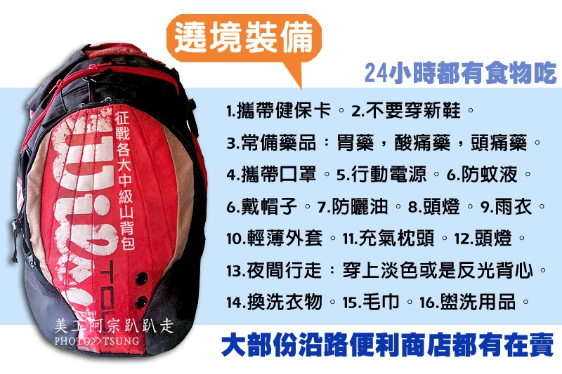

[TOC]
##准备
袜子
- 厚
- 五指袜
鞋子-这真的很重要，建议穿着凉鞋+五指袜再上路。去年我穿运动鞋，结果遇到下雨天，脚都快泡烂了，只好三不五时让脚脚透透气。
出发前让五隻脚指及脚踝缠绕(贴)透气胶带，这可防止水泡的产生。(蛮有效的，走了2~3天我的脚没起任何水泡就是了)
当兵行军大多是靠丝袜,也可参考你这招。
1.外套:我觉得外套非常重要,因为往年走早晚的温差极大,如果没有确定住的地方的朋友,晚上又遇到下雨应该会又觉得想哭了,因为躲小七或庙裡也会很冷,所以一件比较轻但可以保暖的外套很重要。
2.地垫:地垫也很重要,因为若是没地方睡只能在庙裡打地铺时,地板都是磨石地板会很冷,所以我每年都会带很轻的铝箔地垫,休息的时候要垫着坐也方便
3.防蚊液:因为庙裡或者活动中心一类的休息点,蚊子都很多,还有半夜走在大沟旁边,如果有人像我一样是人体吸蚊器那防蚊液就真的很重要了
4.帽子 ,女生:袖套 男生:薄外套(男生如果不怕太娘当然袖套也是可以戴) ,一条毛巾,口罩或遮脸巾
因为白天走的时候,太阳有时候虽然看起来不大,但走上一天可以让你的脖子全部脱皮(我脱过 我是蛇><"),帽子是一定要带的,而袖套或薄外套甚至有人穿骑自行车的那种内搭衣(我穿不住,因为热~~~)都是防止被晒伤,重点来了,脖子后面怎么办,毛巾这时候就派上用场,把它打湿泞到非常干掛在脖子上,既能防止中暑也能防止晒伤
5.一双好走的鞋:我第一年穿布鞋起了许多要命的水泡到彰化就掛白旗投降,第二年穿凉鞋在摩擦处也出了许多大小不一的水泡,之后我学拿令旗的婆婆们穿crocs之后的几年再也没有出过水泡,可能是因为比较通风又比较不摩擦脚,所以走起来也比较不费力,单凭我是扁平足可以年年走完344,我的那双穿了五六年的crocs也功不可没,当然裡面要穿袜子,我都会去小七买透明的短丝袜,穿烂了就丟了,透气又不热~讚~!
6.睡袋:我每年都很想带,但我实在无法负荷啊啊阿...因为本人懒(再强调一次),另外就是负重的问题,但其实睡袋很必要,因为庙裡都比较不会提供棉被,就算有都有点脏(有一次我在南瑶宫盖了一下被蝨子也饱餐了一顿),所以最好是前面说的,有带外套可以盖,不然就是睡袋了

多買了一付鞋墊是給走不動的信徒使用，不買藥布是因為有些人貼了會過敏而起疹或是起泡，水性藥布容易脫落容易起水泡，所以買藥膏塗抹算是比較安全的做法
1.换洗衣裤四套
2.防晒装备+薄毯+毛巾。
3.手机+行动电源
4.透气胶带、ok绷.
5.香油钱

##出行建议
◆腳程慢的人可以提前先走不要跟神轎走，不然會跟不上，因為神轎都在趕路，非常的快幾乎沒有在休息。
◆穿透氣軟底的鞋子會走得比較久，腳底透過散熱後不會腫脹，比全封的鞋子好，涼鞋會是不錯的選擇。

◆當腳已經麻了快走不動，就找個地方坐下來把鞋子脫掉，讓腳冷卻後在前進，一般都是腳血管腫大造成疼痛。

◆起駕前盡量找地方補眠養精蓄銳，也順便做暖身操。

◆不要吃太飽，免得走不動，走路節奏要控制，走太快腳會酸痛，也越走不動，適度的休息是一定要的。

◆可以在大甲橋留下來看國慶及煙火秀不錯看。

◆大甲起駕到深夜沙鹿市區比較沒有機會「稜轎腳」，只有過了沙鹿玉皇殿廟宇駐駕後就可以開始「稜轎腳」。

◆天亮的位置幾乎都在沙鹿玉皇殿駐駕後就慢慢天亮了，到了沙鹿青山宮已經是天亮了。

◆若是怕太累走不動，可以直走省道往大肚前進，因為遶進沙鹿青山宮還是會遶出來到省道，直走可以省一段路。

◆起駕後走不動或是跟不上有免費接駁車可以載你到神轎所在位置下車。

衣服以短袖为主，纯棉或排汗都不错。不过我力推排汗衫，因为其实沿途能借住的民宅或庙宇大多都会有脱水机，此时排汗衫脱水后干很快，可以减少行李重量。如果沿途都找机会洗衣服的话(尤其在新港待两天的时间)，个人觉得二~三件短袖衣服就够了。

除短袖外，必须要一件薄外套，可以遮阳或冷了可以穿，毕竟走路都会热，穿太厚的外套反而是负担。不过像是今年遶境遇到冷气团，风大又冷，温差也大，所以保暖或防风的外套必须再带一件比较保险。

裤子我觉得以有口袋、然后可以防小雨的运动裤或工作裤之类的是不错的选择。我觉得牛仔裤不是很实际，若遇到下雨时会变成负担。有些前辈都穿短裤，比较不热又方便，也是每卖的。

##好用工具
1.天上聖母遶境進香衛星定位服務網  http://mazu.skyeyes.tw/
2.[大甲妈祖绕境进香网站](http://www.dajiamazu.org.tw/Active2016/index.aspx)
- - - - ---
   
 
 
(二) 洗澡用毛巾兩條。
(三) 內衣5件，男女都一樣，女生最好用運動內衣，如果沒有請用素色內衣。
(四) 內褲，5件男生請用四角型長筒純棉內褲，要有彈性才不會燒襠，女生可用免洗褲，男生不行。
(五) 襯衫5件，請用亮色系的顏色，晚上走路後方人員才比較容易看到，長、短袖都可以，短袖的要加一雙袖套，         上衣必須是有領子的才不會曬黑。
(六) 長褲三件，不要太厚太重的，褲管要可以拉到膝蓋的才可以，每件可穿兩天。
(七) 短褲一件，因為有時大腿鐵腿時擦藥比較方便。
(八) 襪子5雙，要用五指襪，中厚的，比平常的厚。
如不想用五指襪也可以把青草布剪一小片，然後貼在腳趾頭上，再穿上一般襪子也行，
