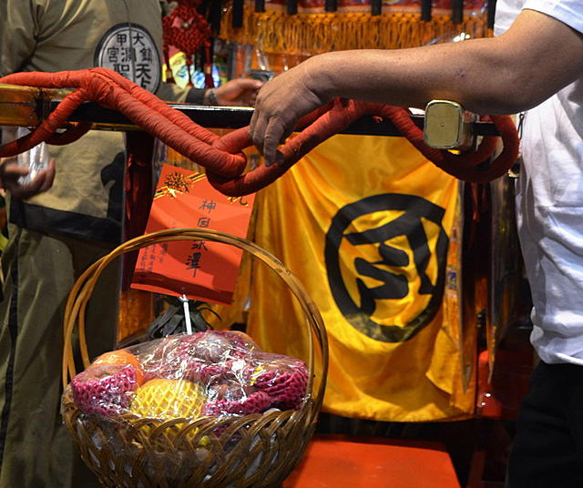

##进香旗
香火都是**灵气**的象征，要向镇澜宫妈祖像敬香，当地叫做“平安香”，每个香客手执一面三角形的香旗，书写自己的名字或地址？在令旗上盖宫庙印与绑紮符令后参香朝拜过炉。
过香火:敬香时把这面小旗在香火上绕几圈，这样才能得到妈祖的保佑。
参与完祝寿大典后，将自己的令旗封住，回程不再打开，以保留祝寿大典时的灵气。
##钻轿底
令旗不可以钻妈祖神轿喔，
妈祖鑾轿去程与回程的判別：去程轿帘微开。回程鑾轿上有信徒奉献的金牌匾额，轿门用黄令旗紧掩以封住神气。 

##顺风耳千里眼
两位大将军头上都会绑紮黄色长条纸钱，称为高钱；手上也有握一把，称为**手钱**。走动甩动时偶会掉落，既然称为钱，看到就赶快抢。（自己抽拿的无效）
##新衣服
里里外外全新的衣服
##钻神轿
- 戴帽子请记住要脱帽

非要钻轿子底下吗？
要让妈祖同意吗

●进香的规矩与禁忌？

进香是一种古礼，所要遵守的规矩与禁忌很多。听前辈讲，早期的进香禁忌很多而且很严格，稍微犯了一点错就会被严惩。但近年来，大概是隨着时代潮流演变，妈祖娘娘惩罚人的标准有变得较为宽鬆一点点了。儘管如此，该遵守的规矩也必须要遵守才行。
以下就列出馆长所知道的禁忌与规矩，虽然没有包含全部，但不知者无罪，在不知情的情况下是可以原谅的。若是已经知道了，馆长就希望各位要遵守才行。

一． 出发前，必须吃素三天！ 
二． 第一次参加进香，全身衣物必须是新的，以示对众神明尊重！ 
三． 出发前，须先用「净香」净身，隨身行李也要净，若有交通工具，记得也要净一净才出发！ 
四． 隨香期间禁酒、禁赌、禁色！ 
五． 自身不洁时不能参加进香！ 
六． 不论在路上看到什么，都不能说出来！（不能乱说话） 　
