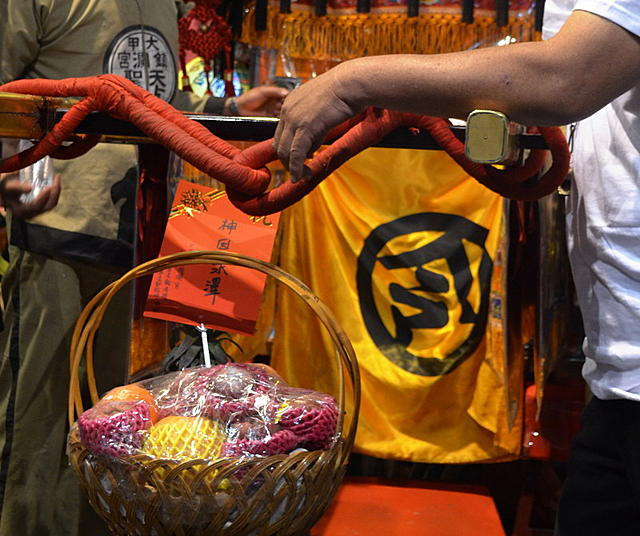

##掷筊
禀报妈祖娘娘...大名、地址、生日、跟妈祖娘娘说要参加今年的进香&进香的方式(徒步、机车、汽车、脚踏车)如果是开车请顺便报上车号，请妈祖娘娘恩准，然后掷筊。
第一件事：要先去向妈祖请示，是否可以参加。如果可以。
第二件事：去买1支进香旗，旗子上头有1条红丝线，可向服务人员要2个平安符、(小小的红色)，4张令符，先把2个平安符绑上去，再把4张令符分成2份，长条状先对折2次，让它比较瘦，再从中对折1次，让它比较短，才绑在进香旗上，做完这些后，在拿去过天公炉内炉(这是请兵将仪式，在要出发前3天或1天要在家举行犒将【台语】，也就是拜进香旗)备好饭菜要双数，
进香旗请领兵将以后，到进香出发日这段时间，要每日点香祭拜。
犒将(军)时，要记得马也要喂，准备一把牧草放在水桶里，水桶里也要装一些水(如下图)。放在祭拜桌子旁边的地上。祭拜完把牧草拿去丢掉就好了。(请兵将，一定要在农历，元月16日以后至进香当日止)。
第三件事：请示妈祖是否可钻轿底。
##起马、下马仪式教学
 ###一、起马仪式
1. 先向家中的神明禀告自己要出远门去跟妈祖进香。
2. 到了妈祖庙，要先向妈祖告知自己是谁，要跟妈祖去进香，现在已经来到妈祖庙。拜完先将香插上香炉，进香旗此时也要过香炉的烟，天公炉，内炉都要，再来拿6张平安附备用，一张行程表，去庙左后方，裕珍馨旁用午餐，再到菜市场二楼报到。
3. 要启程时，还要再跟妈祖告知，自己是谁，要跟妈祖去新港进香，(这时候香要点大枝的，大约一个原子笔的大小，这一支拜完不要插在香炉上，而要拿在手上。)现在要启程，请妈祖一路上帮我们看路头看路尾、一路平安，家里的大大小小，也请妈祖帮我们照顾好，阖家平安就好了。这枝香拿到甲南慈云寺，拜完就插在天公炉不要在拿出来，
 
###二、下马仪式
在妈祖每天晚上住驾的庙宇，要跟这间庙的神明表明你的名字，告诉神明说这次跟妈祖南下进香(或回大甲妈祖庙时)，今晚要在此地过夜，请神明保佑一夜平安。等到明天要离开时，还要向这间庙的神明告诉你的名字，现在要离开，才可以离开。回到大甲妈祖庙时，要向妈祖禀告你的名字，今年跟妈祖至新港进香，现在已经平安回来，弟子要告别妈祖回家去，感谢妈祖保佑一路平安。回到家中也要向家里的神明烧香，禀告自己去跟妈祖进香，现在已经平安回到家里，还要准备饭菜祭拜令旗，才是完成整个下马仪式。马也要用喂，拿一把牧草放在水桶里(水桶里要装水)，然后放在祭拜桌的旁边。

##进香旗
香火都是**灵气**的象征，要向镇澜宫妈祖像敬香，当地叫做“平安香”，每个香客手执一面三角形的香旗。

这个进香旗可以到镇澜宫的服务台买令旗，写上户长的姓名、户籍地址，或是自己的姓名、地址。

然后服务人员会在令旗上盖上镇澜宫的大印，然后再系上镇澜宫的符，最后再到妈祖的香炉过炉，及完成令旗的启用仪式。

过香火:敬香时把这面小旗在香火上绕几圈，这样才能得到妈祖的保佑。(因为香火有灵气)

而沿途中到个庙宇，也是重复此动作。其含意是代表令旗会在您随行中，会有神将保佑您一路平安，而个庙宇皆有灵气，当令旗在过炉的动作，就是在汇集灵气，所以若参与了数十年以上的老旧令旗，就更具有灵气了！

除非下雨，不然进香旗是不能用袋子收起来。参与完祝寿大典后，将自己的令旗封住，就要跟妈祖秉告祭拜完成，过火，就封旗，回程不再打开，以保留祝寿大典时的灵气。

最后到镇澜宫时就要"落马"，报告进香完成，给庙方盖印的时候就可以拆封，离庙时又要封旗，回到家才可以拆封。

将进香旗请回家，就必须参加三年。前辈说这是规矩哦！有了进香旗就必须隨香三年才行。那，要是有事不能参加怎么办？**前辈说，只要在进香前夕跟妈祖请示就行了。 **

休息也要把令旗放直放于头部,不可以放在脚ㄚ边喔.上厕所请人帮忙带拿着,不可以带进厕所喔。令旗不可以钻妈祖神轿喔。
##符
部分隨香客的旗子上都有为数可观的符令，但有的人却很少。据版主了解，符令是一种「即使不要了也不能隨便丟弃」的特殊物品，必须「从那裡来，就从那裡去」。

也就是说，在ｘｘ宫拿的就要回ｘｘ宫化掉。但在大甲妈祖遶境进香时所拿的符较特別，可以在家裡化掉，若家裡没金炉可化，就全部拿回镇澜宫化。

也因为符令是这么的特殊，再加上有些前辈隨香的习性不同（不入庙拜，只走全程），所以不是每个人的进香旗上都会有很多符。版主曾听前辈讲，符是神明的物品，**如果只是因为想跟別人一样绑一大串而拿取，那还不如不要拿。因此，在伸出手之前，请再想想。**

##钻轿底
妈祖鑾轿去程与回程的判別：去程轿帘微开。回程鑾轿上有信徒奉献的金牌匾额，轿门用黄令旗紧掩以封住神气。 

- 戴帽子请记住要脱帽

##新衣服
里里外外全新的衣服

